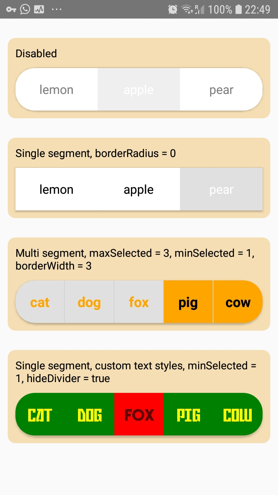
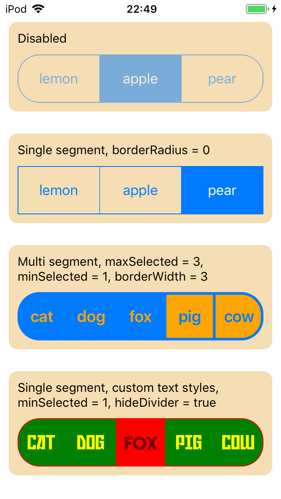

<!-- Bootstrapped with make-react-native-package v0.0.0 -->

# react-native-multi-segmented-control
[](https://badge.fury.io/js/react-native-multi-segmented-control)
[](https://circleci.com/gh/iyegoroff/react-native-multi-segmented-control)
[](https://github.com/standard/standard)
[](https://david-dm.org/iyegoroff/react-native-multi-segmented-control)
[](https://david-dm.org/iyegoroff/react-native-multi-segmented-control?type=dev)
[](package.json)
[](https://www.npmjs.com/package/react-native-multi-segmented-control)

Multi segmented control for iOS & Android

## Status

- iOS & Android:
  - based on [attheodo/ATHMultiSelectionSegmentedControl](https://github.com/attheodo/ATHMultiSelectionSegmentedControl) & [savvyapps/ToggleButtonLayout](https://github.com/savvyapps/ToggleButtonLayout)
  - package exports two components - `MultiSegmentedControl` and `SingleSegmentedControl`
  - only text segments are available
- react-native:
  - supported versions "<strong>&gt;= 0.60.0</strong>"

## Installation

<table>
<td>
<details style="border: 1px solid; border-radius: 5px; padding: 5px">
  <summary>with react-native "<strong>&gt;=0.60.0</strong>"</summary>

### 0. Setup Swift and Kotlin

- Open your iOS project in Xcode and create empty Swift file and bridging header to enable Swift support
- Modify `android/build.gradle`:

  ```diff
  buildscript {
    ext {
      ...
  +   kotlinVersion = "1.3.50"
    }
  ...

    dependencies {
  +   classpath("org.jetbrains.kotlin:kotlin-gradle-plugin:${kotlinVersion}")
      ...
  ```

### 1. Install latest version from npm

`$ npm i react-native-multi-segmented-control -S`

### 2. Install pods

`$ cd ios && pod install && cd ..`

### 3. Final step

Modify `android/build.gradle` again:

  ```diff
  ...

  allprojects {
    repositories {
      ...
  +   maven { url 'https://jitpack.io' }
    }
  }
  ```

</details>
</td>
</table>

## Demo

 Android                                       |  iOS
:---------------------------------------------:|:---------------------------------------------:
  |  

## Example

```jsx
import * as React from 'react'
import { MultiSegmentedControl } from 'react-native-multi-segmented-control'

export const Control = () => (
  <MultiSegmentedControl
    style={{ height: 55, width: '100%' }}
    values={['cat', 'dog', 'fox', 'pig', 'cow']}
    onChange={({ nativeEvent }) => console.warn(nativeEvent.changedIndex)}
    selectedIndices={[1, 2]}
  />
)
```

## Reference

`MultiSegmentedControl` and `SingleSegmentedControl` components support all of `View` props and share some common props. `MultiSegmentedControl` additionally has `maxSelected` and `selectedIndices` props, and `SingleSegmentedControl` has additional `selectedIndex` prop.

<table>
  <tr>
    <th>prop</th>
    <th>type</th>
    <th>default</th>
    <th>desc</th>
  </tr>
  <tr>
    <td>values</td>
    <td><code>Array&lt;string&gt;</code></td>
    <td>-</td>
    <td><strong>required</strong></td>
  </tr>
  <tr>
    <td>tintColor</td>
    <td><code>string</code></td>
    <td>-</td>
    <td></td>
  </tr>
  <tr>
    <td>enabled</td>
    <td><code>boolean</code></td>
    <td><code>true</code></td>
    <td></td>
  </tr>
  <tr>
    <td>selectedIndices</td>
    <td><code>Array&lt;number&gt;</code></td>
    <td>-</td>
    <td>MultiSegmentedControl only</td>
  </tr>
  <tr>
    <td>selectedIndex</td>
    <td><code>number</code></td>
    <td>-</td>
    <td>SingleSegmentedControl only</td>
  </tr>
  <tr>
    <td>onChange</td>
    <td><pre>(event:&nbsp;NativeSyntheticEvent&lt;{
  selectedIndices:&nbsp;Array&lt;number&gt;,
  selectedValues:&nbsp;Array&lt;string&gt;,
  changedIndex:&nbsp;number,
  changedIndexSelected:&nbsp;boolean,
}&gt;)&nbsp;=&gt;&nbsp;void</pre></td>
    <td>-</td>
    <td></td>
  </tr>
  <tr>
    <td>hideDivider</td>
    <td><code>boolean</code></td>
    <td>-</td>
    <td>ios only</td>
  </tr>
  <tr>
    <td>dividerColor</td>
    <td><code>string</code></td>
    <td>-</td>
    <td>android only, no divider by default</td>
  </tr>
  <tr>
    <td>minSelected</td>
    <td><code>number</code></td>
    <td><code>0</code></td>
    <td>disabled when 0</td>
  </tr>
  <tr>
    <td>maxSelected</td>
    <td><code>number</code></td>
    <td><code>0</code></td>
    <td>MultiSegmentedControl only, disabled when 0</td>
  </tr>
  <tr>
    <td>textStyle</td>
    <td><code>TextStyle</code></td>
    <td>-</td>
    <td>supports color, fontFamily, fontWeight, fontStyle and fontSize</td>
  </tr>
  <tr>
    <td>selectedTextStyle</td>
    <td><code>TextStyle</code></td>
    <td>textStyle</td>
    <td>supports color, fontFamily, fontWeight, fontStyle and fontSize</td>
  </tr>
</table>
